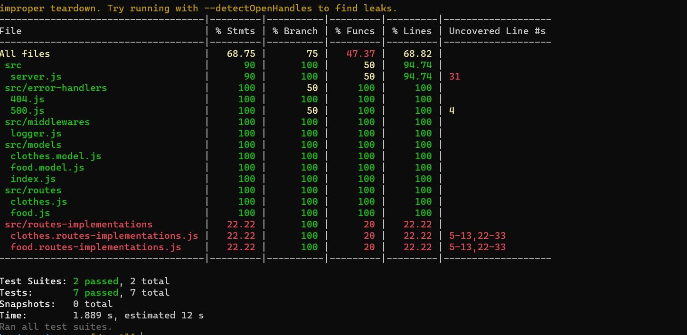
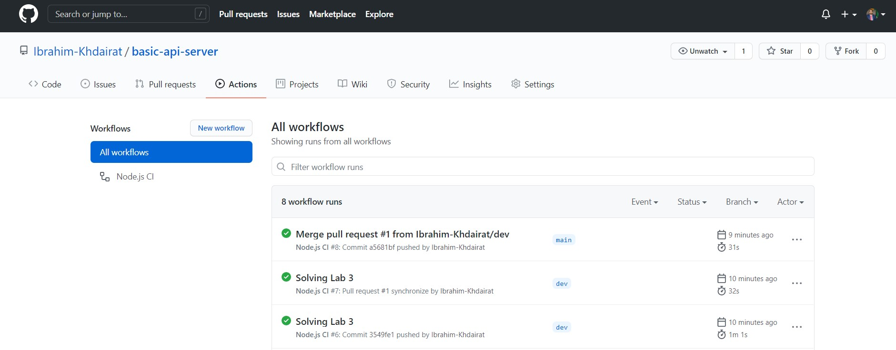

https://github.com/Ibrahim-Khdairat/basic-api-server/pull/1

https://github.com/Ibrahim-Khdairat/basic-api-server/actions

# Lab 03 -  Basic-Api-Server

##### Author : Ibrahim Khdairat 

* [GitHub Repo Link](https://github.com/Ibrahim-Khdairat/basic-api-server)

* [Pull Request](https://github.com/Ibrahim-Khdairat/basic-api-server/pull/1)

* [Heroku Link](https://ibrahim-basic-api-server.herokuapp.com/) : https://ibrahim-basic-api-server.herokuapp.com/

##### Setup
`.env` requirements
  * `PORT` - Port Number

**Running the app**
* `npm start`
* Endpoints:
* ##### 1 -  `/status`
https://ibrahim-basic-api-server.herokuapp.com/status
Returns Object

>{
  "domain": "ibrahim-basic-api-server.herokuapp.com",
  "status": "running",
  "port": 3000
}

* ##### 2 -  `food`  
https://ibrahim-basic-api-server.herokuapp.com/food

> *You should enter your name in the search query or you'll get an 404 Not Found Error*

Returns Object

>{
  "foodName": "The food Name Will Show Here",
  "foodSize": "The Size Will Show Here"
}

* ##### 3 -  `clothes`  
https://ibrahim-basic-api-server.herokuapp.com/clothes

> *You should enter your name in the search query or you'll get an 404 Not Found Error*

Returns Object

>{
  "clothesName": "The clothes Name Will Show Here",
  "clothesSize": "The Size Will Show Here"

}

**Tests**
* Unit Tests: `npm run test`

**Test Result**

**Actions Result**

